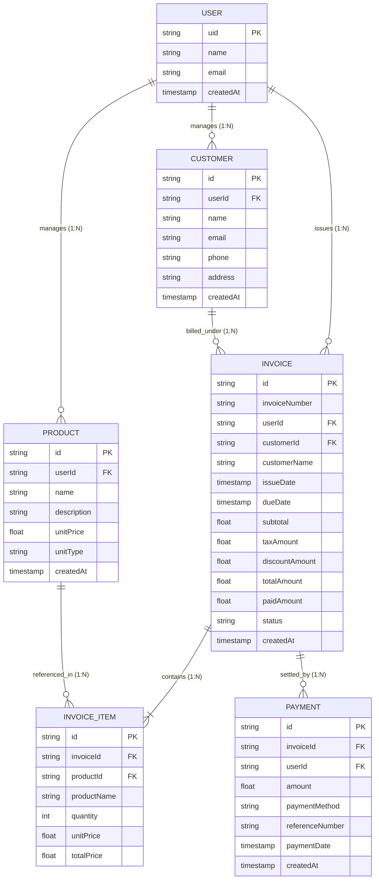
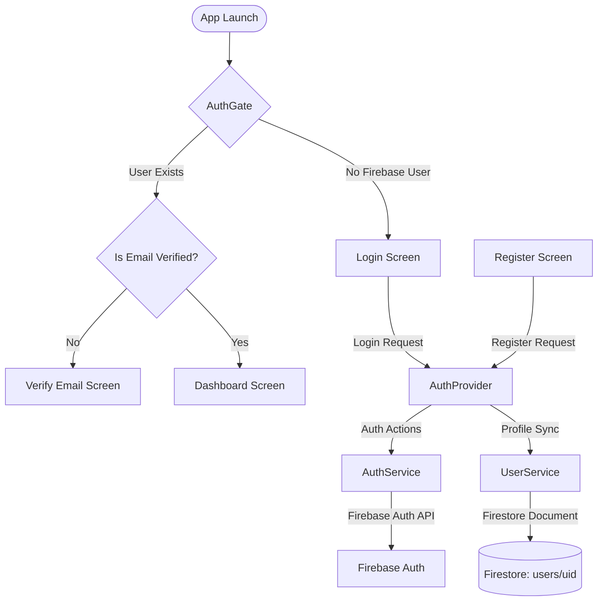

# Invoxa — System Architecture & Design

## 1. Architectural Philosophy

Invoxa follows a strict **Layered Architecture** with clear boundaries separating UI representation, application state & business logic, service abstraction, and cloud persistence.

The key guiding rule is: **Unidirectional flow and separation of concerns.**

```
+--------------------------------------------------------+
|                      Screen / UI                       |
|           (Widgets, User Input, View State)            |
+--------------------------------------------------------+
                           |
                           v
+--------------------------------------------------------+
|                 Provider (ChangeNotifier)               |
|         (State Management, Business Logic, Async)      |
+--------------------------------------------------------+
                           |
                           v
+--------------------------------------------------------+
|                        Service                         |
|         (Firebase Auth, Firestore Queries, Storage)    |
+--------------------------------------------------------+
                           |
                           v
+--------------------------------------------------------+
|                   Cloud Persistence                    |
|             (Firebase Auth & Cloud Firestore)          |
+--------------------------------------------------------+
```

---

## 2. Layer Responsibilities & Boundaries

### 2.1 UI / Screen Layer (`lib/screens/`, `lib/widgets/`)
- **Responsibilities:**
  - Rendering UI widgets and visual layouts.
  - Capturing user actions (taps, inputs, form submissions).
  - Listening to state changes from Providers using `context.watch()` or `Consumer`.
  - Triggering business actions via `context.read<Provider>().action()`.
- **Strict Boundaries:**
  - **NEVER** import or call `FirebaseFirestore` or `FirebaseAuth` directly.
  - **NEVER** calculate business totals or orchestrate multi-step data persistence inside widgets.

### 2.2 Provider Layer (`lib/providers/`)
- **Responsibilities:**
  - Holding in-memory application and feature state.
  - Managing loading (`isLoading`) and error (`errorMessage`) states.
  - Executing business rules (calculating invoice totals, validating customer selections).
  - Calling the underlying service layer and updating internal state.
  - Emitting UI re-render notifications via `notifyListeners()`.
- **Strict Boundaries:**
  - Providers do not handle UI rendering or direct BuildContext widget construction.
  - Providers interact with the outside world only via Services.

### 2.3 Service Layer (`lib/services/`)
- **Responsibilities:**
  - Encapsulating all network calls, Firestore read/write operations, and Firebase Authentication calls.
  - Serializing and deserializing domain data via model converters (`toFirestore()`, `fromFirestore()`).
  - Handling cloud exceptions and mapping them to predictable app errors.
- **Strict Boundaries:**
  - Services are pure Dart classes; they never hold UI state or invoke `notifyListeners()`.
  - Services never depend on widgets or UI contexts.

### 2.4 Domain Model Layer (`lib/models/`)
- **Responsibilities:**
  - Representing pure business entities with immutable properties (`@immutable`).
  - Serializing to and from Firestore document maps (`toMap()`, `fromMap()`, `toFirestore()`, `fromFirestore()`).
  - Providing utility methods like `copyWith()` for immutable state updates.

---

## 3. Domain Entity Relationship Diagram



---

## 4. Authentication Architecture

The authentication pipeline handles onboarding, session persistence, security enforcement, and email verification gating.



### Components:
- **`AuthGate`:** Decides the root visual screen reactively by observing `AuthProvider` / `AuthService.userChanges`.
- **`AuthService`:** Interacts directly with `FirebaseAuth` for credential registration, login, token refresh, and verification emails.
- **`UserService`:** Manages the Firestore document representation under `/users/{uid}`.
- **`AuthProvider`:** Coordinates auth and user profile state, providing unified loading and error handling to the UI.

---

## 5. Multi-Tenant Data Scoping & Security

Invoxa operates under a **Strict Tenant Isolation** model:
1. Every business document must be linked to the creating user via `userId == request.auth.uid`.
2. Under no circumstance may queries omit the authenticated user's ID filter.
3. Firestore security rules act as the final, immutable boundary.

### Firestore Collections Structure:
- `users/{uid}`: Single profile document per user.
- `customers/{customerId}`: Scoped with `userId` field.
- `products/{productId}`: Scoped with `userId` field.
- `invoices/{invoiceId}`: Scoped with `userId` and `customerId` fields.
- `payments/{paymentId}`: Scoped with `userId` and `invoiceId` fields.

### Firestore Rules Principle:
```javascript
rules_version = '2';
service cloud.firestore {
  match /databases/{database}/documents {
    // User profile isolation
    match /users/{userId} {
      allow read, write: if request.auth != null && request.auth.uid == userId;
    }

    // Tenant-scoped business collections
    match /customers/{customerId} {
      allow read, write: if request.auth != null && request.auth.uid == resource.data.userId;
      allow create: if request.auth != null && request.auth.uid == request.resource.data.userId;
    }

    match /products/{productId} {
      allow read, write: if request.auth != null && request.auth.uid == resource.data.userId;
      allow create: if request.auth != null && request.auth.uid == request.resource.data.userId;
    }

    match /invoices/{invoiceId} {
      allow read, write: if request.auth != null && request.auth.uid == resource.data.userId;
      allow create: if request.auth != null && request.auth.uid == request.resource.data.userId;
    }

    match /payments/{paymentId} {
      allow read, write: if request.auth != null && request.auth.uid == resource.data.userId;
      allow create: if request.auth != null && request.auth.uid == request.resource.data.userId;
    }
  }
}
```

---

## 6. State Management Strategy

1. **Provider (`ChangeNotifier`):** Standard, lightweight, predictable state management without external reactive engine bloat.
2. **Feature Isolation:** Each functional vertical owns its provider (`CustomerProvider`, `ProductProvider`, `InvoiceProvider`, `PaymentProvider`).
3. **Local UI State:** Ephemeral form fields, text editing controllers, and animation states remain in local `StatefulWidget` or `State` objects.
4. **Data Synchronization:** Providers notify listeners when queries succeed or mutations take effect, ensuring declarative UI consistency.
